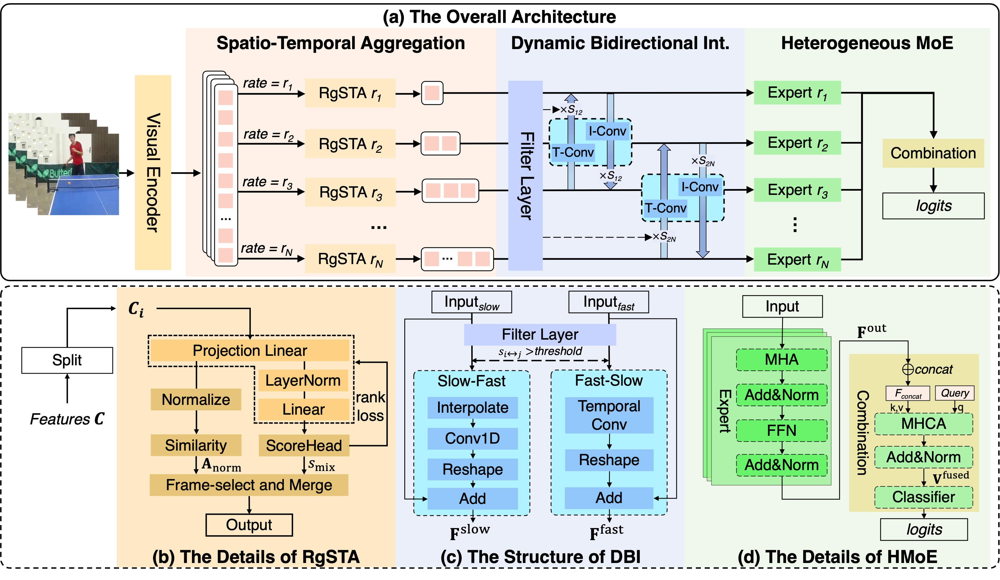

## [CVPR 2026] Official repository for "VidPrism: Heterogeneous Mixture of Experts for Image-to-Video Transfer"

## Overview



Official repository for VidPrism, a new temporal MoE framework that addresses the limitation of expert homogenization in image-to-video transfer learning. VidPrism presents the content-aware sampling module and a bidirectional fusion mechanism to enhance the representations of different video data streams. The results show that VidPrism achieves superior results in video recognition.

## Train & Test
```
bash scripts/run_train.sh configs/dataset/dataset.yaml
bash scripts/run_test.sh configs/dataset/dataset.yaml
```

## Requirements

- Python 3.10+
- PyTorch, TorchVision, and Torchaudio
- Install the remaining dependencies with:

```bash
pip install -r requirements.txt
```

- If you use the VideoMAE training pipeline, make sure `transformers` is installed from `requirements.txt`.

## Acknowledgment

This code is built upon [MoTE](https://github.com/ZMHH-H/MoTE.git).

